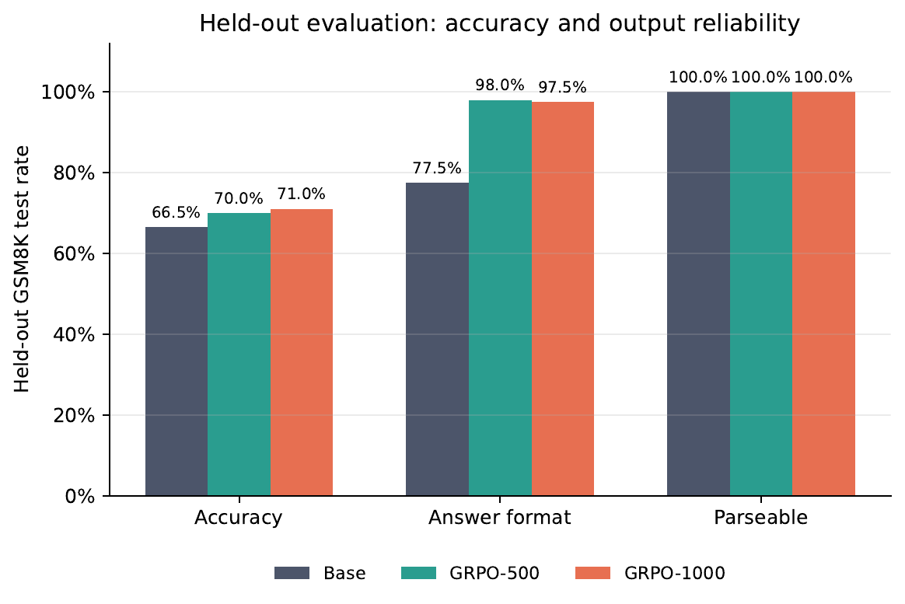
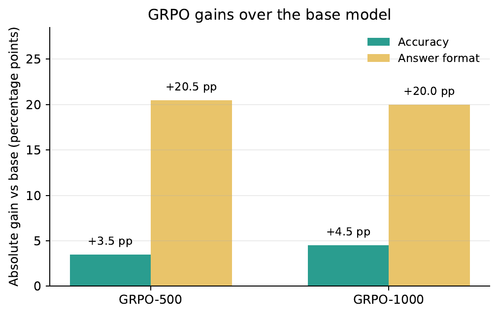
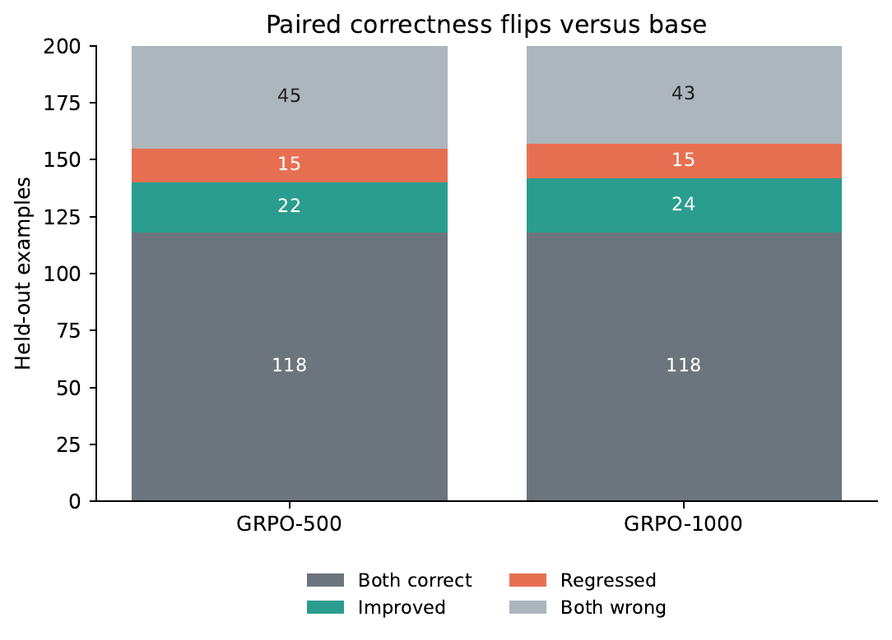
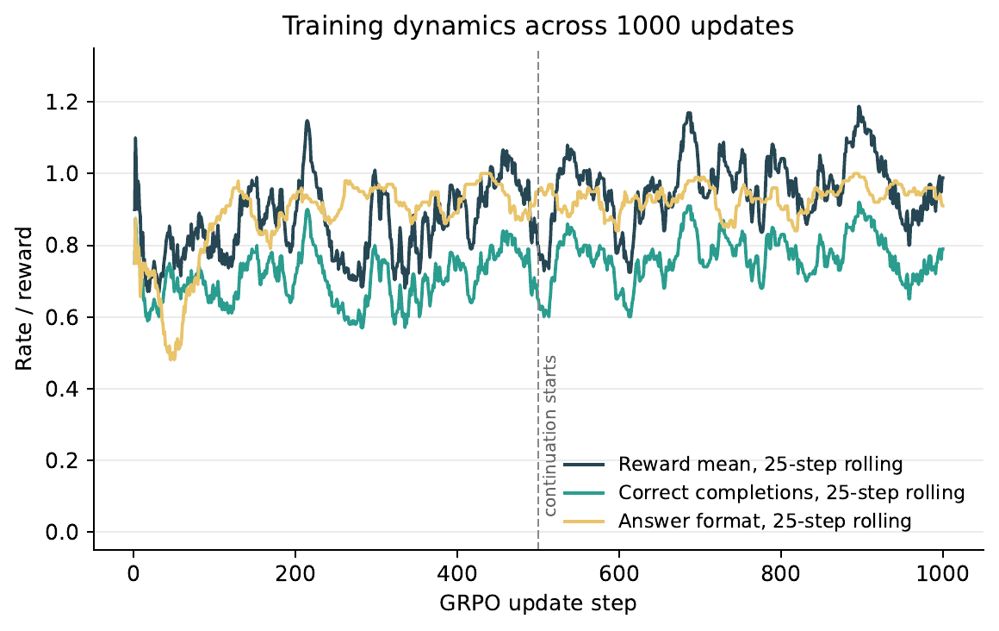

# TinyGRPO-Math

Rule-based GRPO post-training for GSM8K math reasoning with a compact instruction model.

This project adapts a from-scratch GRPO loop to verifiable math reasoning. Instead of training a reward model, it uses deterministic rewards for final-answer correctness, output format, parseability, length, and truncation.

## Result

Base model: `Qwen/Qwen2.5-1.5B-Instruct`  
Dataset: `openai/gsm8k`  
Training: 1000 GRPO updates over 1000 GSM8K train examples  
Evaluation: 200 held-out GSM8K test examples

| Model | Correct | Accuracy | Answer format | Parseable | Truncated | Avg reward |
|---|---:|---:|---:|---:|---:|---:|
| Base | 133/200 | 66.5% | 155/200, 77.5% | 200/200 | 0/200 | 0.786 |
| GRPO-500 | 140/200 | 70.0% | 196/200, 98.0% | 200/200 | 0/200 | 0.876 |
| GRPO-1000 | 142/200 | 71.0% | 195/200, 97.5% | 200/200 | 0/200 | 0.889 |

**Net improvement:** +4.5 percentage points accuracy and +20.0 percentage points final-answer format compliance versus the base model.

This is a pilot-scale result, not a benchmark claim. On the 200-example paired eval, GRPO-1000 improved 24 examples and regressed 15 examples, for a net gain of 9.





## Matched Ablations

Two single-change ablations used the same seed, train rows `0:1000`, two 500-update stages, decoding settings, and 200-example held-out evaluation as GRPO-1000.

| Run | Correct | Accuracy | Answer format | Parseable | Truncated |
|---|---:|---:|---:|---:|---:|
| Full GRPO-1000 | 142/200 | 71.0% | 195/200, 97.5% | 200/200, 100% | 0/200 |
| No KL (`beta=0`) | 136/200 | 68.0% | 195/200, 97.5% | 200/200, 100% | 2/200 |
| No positive format/parseability reward | 138/200 | 69.0% | 169/200, 84.5% | 200/200, 100% | 1/200 |

Neither ablation improves held-out accuracy. The no-KL result is 3.0 points below full GRPO, indicating that the KL reference is useful in this setup. Removing only the `+0.2` final-format and `+0.1` parseability bonuses costs 2.0 accuracy points and 13.0 points of final-answer compliance, while measured parseability remains saturated at 100%.

These are matched single-seed sensitivity checks, not definitive causal estimates. Average rewards are intentionally omitted because the no-shaping run uses a different reward scale.

## Full Report

The detailed report includes training curves, paired flip analysis, group-level GRPO signal quality, and GPU resource usage:

- [PDF report](reports/tinygrpo_math_report.pdf)
- [LaTeX source](reports/tinygrpo_math_report.tex)
- [Analysis summary JSON](reports/analysis_summary.json)





## Repository Layout

```text
.
├── scripts/
│   ├── tinygrpo_math.py          # Main training/eval script
│   ├── turing_ablation_no_kl.sh
│   └── turing_ablation_no_format_parseability_reward.sh
├── reports/
│   ├── tinygrpo_math_report.pdf  # Compiled report
│   ├── tinygrpo_math_report.tex  # LaTeX source
│   ├── analysis_summary.json     # Aggregated metrics
│   └── figures/                  # README/report figures
├── tinygrpo_math.ipynb           # Notebook runner around the script
├── requirements.txt
└── README.md
```

Raw outputs and model checkpoints are intentionally ignored by Git. The curated report and figures are kept.

## Setup

Use Python 3.10+.

Install a CUDA-compatible PyTorch build separately for your machine or cluster. Then install the project dependencies:

```bash
python3 -m venv .venv-tinygrpo
source .venv-tinygrpo/bin/activate
python3 -m pip install --upgrade pip
python3 -m pip install -r requirements.txt
```

For PyTorch, use the install command recommended by https://pytorch.org for your CUDA version. On a cluster, do not blindly reinstall `torch` if the environment already provides a working CUDA build.

Optional but recommended:

```bash
python3 -m pip install -U "math-verify[antlr4_13_2]"
```

The script falls back to its own numeric parser if `math-verify` is not installed.

## Baseline Evaluation

```bash
PYTORCH_CUDA_ALLOC_CONF=expandable_segments:True python3 scripts/tinygrpo_math.py \
  --mode eval \
  --model_name Qwen/Qwen2.5-1.5B-Instruct \
  --eval_size 200 \
  --output_dir outputs/qwen25_15_answer_base_eval200
```

## First GRPO Stage

Train on GSM8K train rows `0:500`:

```bash
PYTORCH_CUDA_ALLOC_CONF=expandable_segments:True python3 scripts/tinygrpo_math.py \
  --mode train \
  --model_name Qwen/Qwen2.5-1.5B-Instruct \
  --train_offset 0 \
  --train_size 500 \
  --eval_size 200 \
  --max_train_updates 500 \
  --group_size 4 \
  --train_batch_size 2 \
  --learning_rate 5e-6 \
  --beta 0.05 \
  --temperature 0.7 \
  --top_p 0.95 \
  --checkpoint_every 500 \
  --output_dir outputs/qwen25_15_grpo500 \
  --save_model
```

Evaluate:

```bash
PYTORCH_CUDA_ALLOC_CONF=expandable_segments:True python3 scripts/tinygrpo_math.py \
  --mode eval \
  --eval_model_path outputs/qwen25_15_grpo500/final_model \
  --eval_size 200 \
  --output_dir outputs/qwen25_15_grpo500_eval200
```

## Continuation Stage

This initializes the policy from the GRPO-500 checkpoint while keeping the KL reference anchored to the original base model.

Train on GSM8K train rows `500:1000`:

```bash
PYTORCH_CUDA_ALLOC_CONF=expandable_segments:True python3 scripts/tinygrpo_math.py \
  --mode train \
  --model_name Qwen/Qwen2.5-1.5B-Instruct \
  --init_model_path outputs/qwen25_15_grpo500/final_model \
  --train_offset 500 \
  --train_size 500 \
  --eval_size 200 \
  --max_train_updates 500 \
  --group_size 4 \
  --train_batch_size 2 \
  --learning_rate 2e-6 \
  --beta 0.05 \
  --temperature 0.7 \
  --top_p 0.95 \
  --checkpoint_every 500 \
  --output_dir outputs/qwen25_15_grpo500_plus500 \
  --save_model
```

Evaluate:

```bash
PYTORCH_CUDA_ALLOC_CONF=expandable_segments:True python3 scripts/tinygrpo_math.py \
  --mode eval \
  --eval_model_path outputs/qwen25_15_grpo500_plus500/final_model \
  --eval_size 200 \
  --output_dir outputs/qwen25_15_grpo500_plus500_eval200
```

## Reward

The reward is deterministic:

| Condition | Reward |
|---|---:|
| Final answer numerically correct | +1.0 |
| Completion ends with a recognized final answer line | +0.2 |
| Answer is parseable | +0.1 |
| Parseable answer is wrong | -0.4 |
| No parseable answer | -0.5 |
| Completion exceeds character budget | -0.2 |
| Generation reaches max length without EOS | -0.3 |

The intended final format is:

```text
Answer: <number>
```

The scorer also accepts common fallback formats like `Final Answer: <number>` and boxed LaTeX answers.

`--format_reward` and `--parseable_reward` default to `0.2` and `0.1`, respectively. Setting both to `0` reproduces the no-positive-shaping ablation while leaving correctness and penalty terms unchanged.

## Logs

Each training run writes:

```text
args.json
reward.log
train_metrics.jsonl
reward_debug.jsonl
final_model/              # ignored by Git
checkpoint_step_*/        # ignored by Git
```

Each evaluation run writes:

```text
args.json
eval_metrics.json
eval_samples.jsonl
```

`reward_debug.jsonl` contains full prompts, completions, parsed answers, reward components, token counts, truncation flags, and GPU stats.

## Notes

- Training uses the GSM8K train split.
- Evaluation uses the GSM8K test split.
- An exact question-text overlap check between train rows `0:1000` and test rows `0:200` found 0 overlaps.
- The current result is side-project scale. The matched no-KL and no-positive-shaping checks are useful sensitivity evidence, but a full benchmark claim would still require larger evaluation, repeated seeds, and further ablations over group size and dataset slice.
